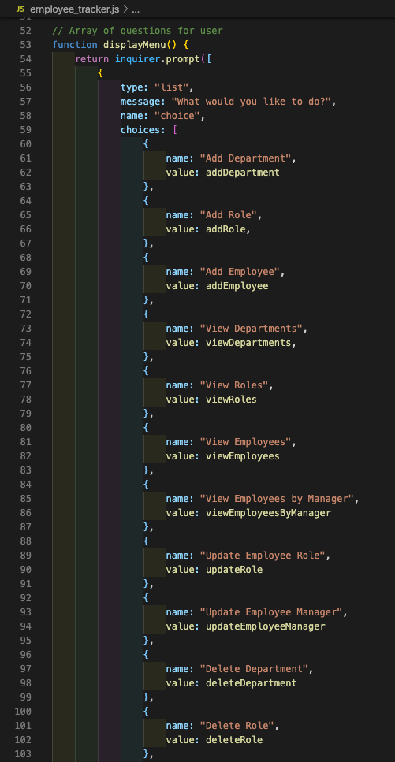
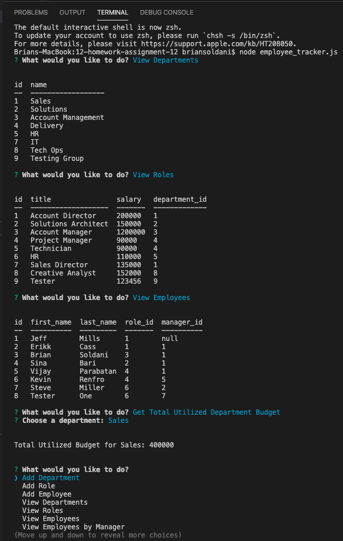
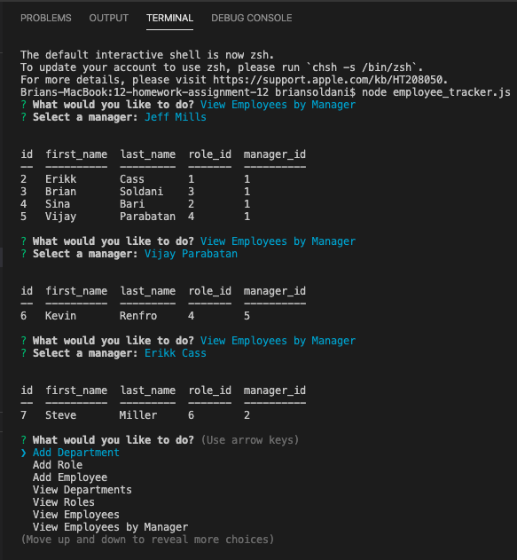

# Unit 12 MySQL Homework: Employee Tracker

## Video Demo of Working Application
https://drive.google.com/file/d/1vqO2DSx1UffrOxrxDZ1mt5VYVwpqCHuU/view

## Description

This assignment was to create an interface that makes it easy for non-developers to view and interact with information stored in databases. This is my version of a Content Management System (CMS), that uses using node, inquirer, and MySQL for managing any company's employees, roles, and departments.  

### Project Details

Here are some of the specific items that were required, as well as some extras, that I've included in my final application.

The following database schema containing three tables:

* **Departments**:

  * **id** - INT PRIMARY KEY
  * **name** - VARCHAR(30) to hold department name

* **Roles**:

  * **id** - INT PRIMARY KEY
  * **title** -  VARCHAR(30) to hold role title
  * **salary** -  DECIMAL to hold role salary
  * **department_id** -  INT to hold reference to department role belongs to

* **Employees**:

  * **id** - INT PRIMARY KEY
  * **first_name** - VARCHAR(30) to hold employee first name
  * **last_name** - VARCHAR(30) to hold employee last name
  * **role_id** - INT to hold reference to role employee has
  * **manager_id** - INT to hold reference to another employee that manager of the current employee. This field may be null if the employee has no manager

### Acceptance Criteria
  
Based on the tables and schema above, I've built a command-line application that allows the user to perform 13 different functions.

  - Add Departments, Roles, Employees

  - View Departments, Roles, Employees, and Employees by Manager

  - Update Employee Roles and Managers

  - Delete Departments, Roles, and Employees

  - View the total utilized budget of a Department (the combined salaries of all Employees in that Department)

### Results

The final application performs as expected and meets all of the requirements given above, which include the bonus features that were part of the challenge. 

### Images

- Single Display Menu 
 

- View Departments, Roles, and Employees + Department Budget 
 

- Employees by Manager 
 